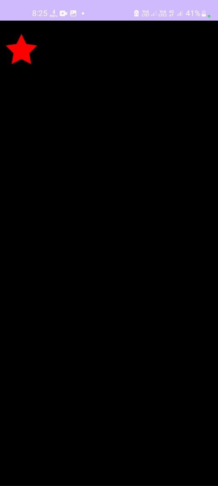
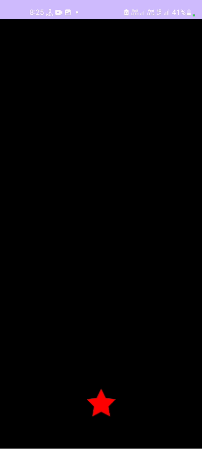
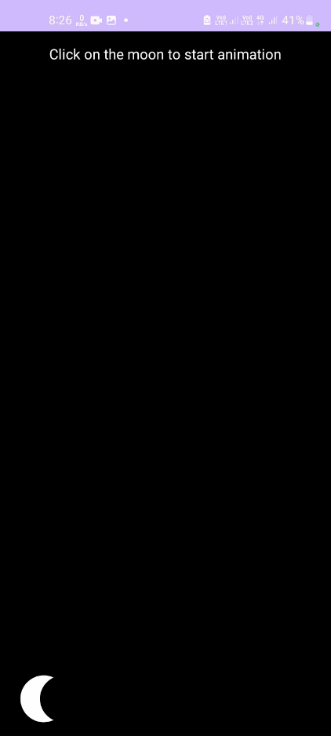

# Motion Layout Example #

The app has four different animations created using MotionLayout.

## App Preview ##

 

## Motion Layout ##

MotionLayout is a library for adding animations in an Android app. It's based upon ConstraintLayout
and can be used to animate anything that is built using ConstraintLayout.

We can use MotionLayout to animate the location, size, visibility, alpha, color, elevation,
rotation, and other attributes of multiple views at the same time. Using declarative XML we can
create coordinated animations involving multiple views that are difficult to achieve in code.
Following are properties of MotionLayout.

Coordinate - Animate multiple views at same time.
Reversible - Animations can run in reverse order.
Seekable - Jump to any point in the animation with code.

## MotionScene ##

We add views to the MotionLayout, same as a ConstraintLayout. The animation part is defined in a
separate xml file called `MotionScene`, pointing the MotionLayout to it
using `app:layoutDescription` property. MotionScene defines a transition between the start state and
end state of the animation. These states are defined by ConstraintSets, which is a set of
constraints that describe a MotionLayout screen. The transition can be triggered with events like
click, swipe, etc.

## KeyPosition ##

By default, MotionLayout plots a linear path between the start and end position of each view.
KeyPosition is used to modify the path a view takes between the start and the end ConstraintSet. It
can distort the path of a view to go through one or more points between the start and end positions.
The KeyPositions are put in a `<KeyFrameSet>` inside the `<Transition>`. A KeyPosition can only
change the path during the animation, it cannot change the start or the end. KeyPosition has
following attributes :

framePosition - a number between 0 and 100 to say when in the animation this KeyPosition should be
applied, with 1 being 1% through the animation, and 99 being 99% through the animation. So if the
value is 50, we apply it right in the middle.

motionTarget - the view for which this KeyPosition modifies the path

keyPositionType - how this KeyPosition modifies the path. It can be either parentRelative,
pathRelative, or deltaRelative.

percentX | percentY - how much to modify the path at framePosition (values between 0.0 and 1.0, with
negative values and values > 1 allowed)

## KeyAttribute ##

KeyAttribute is used to modify an attribute of the view during animation. The attributes include
rotate, scale, translate, elevation, alpha and visibility. A `KeyAttribute` is put inside
the `KeyFrameSet`.

## CustomAttribute ##

To change other attributes like color, which cannot be modified by the `KeyAttribute`, we
use `CustomAttribute`. It can modify anything that has a getter and setter and it goes inside
a `KeyAttribute`. Eg. change colorFilter on a ImageView or backgroundColor of a view.

## Seekable Animation ##

The MotionLayout can seek to a specific point in the animation in code. We can do this by
setting `motionLayout.progress`. MotionLayout will immediately "jump" to the position that was
specified.

## Helpful Tips ##

1. Any constraints specified in a `ConstraintSet` will override the constraints specified in the
   layout file. If we define constraints in both the layout and the `MotionScene`, only the
   constraints in the `MotionScene` are applied.

2. Views that are not animated by a `MotionLayout` animation should specify their constraints in the
   layout XML file. `MotionLayout` will not modify constraints that aren't referenced by
   a `<Constraint>` in the `<MotionScene>`. Views that are animated should have their constraints
   set in the motion scene XML file.

3. The `motionDebug` attribute of `MotionLayout` shows path and debugging information
   in `MotionLayout`.
   - Circles - represent the start or end position of one view
   - Lines - represent the path of one view
   - Diamonds - represent a KeyPosition that modifies the path.

4. The `touchAnchorSide` passed to `OnSwipe` must progress in a single direction through the entire
   animation.
   If the anchored side reverses its path, or pauses, MotionLayout will get confused and not
   progress in a smooth motion.

5. In some animations, no view has an appropriate `touchAnchorSide`.This may happen if every side
   follows a complex path through the motion or views resize in ways that would cause surprising
   animations. In these situations, we can add an invisible view that follows a simpler path to
   track.